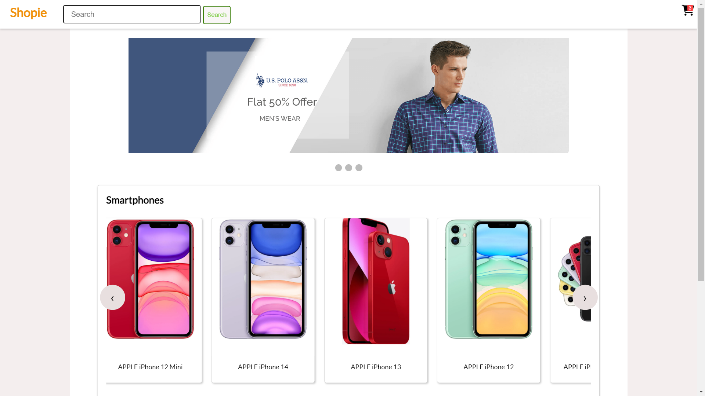
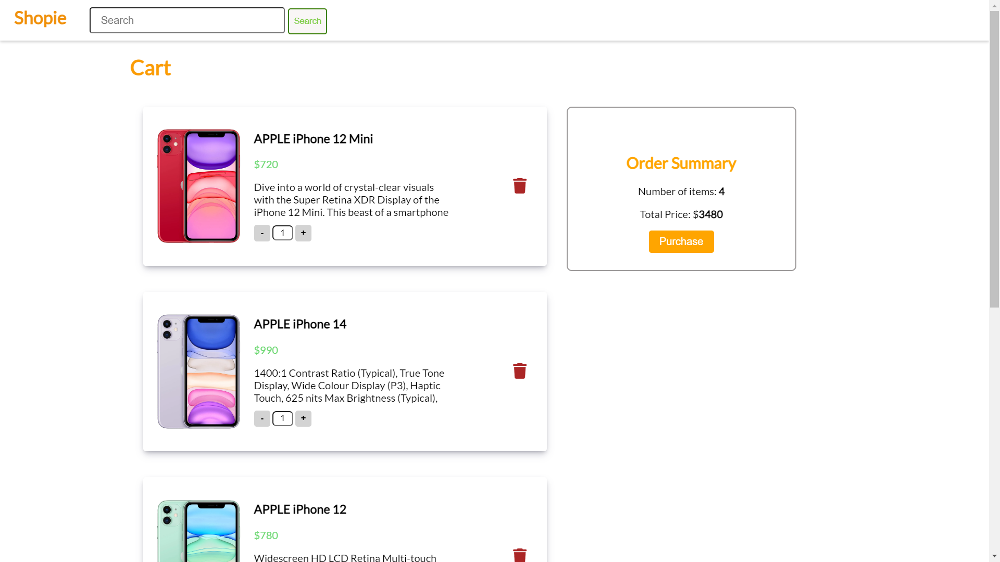
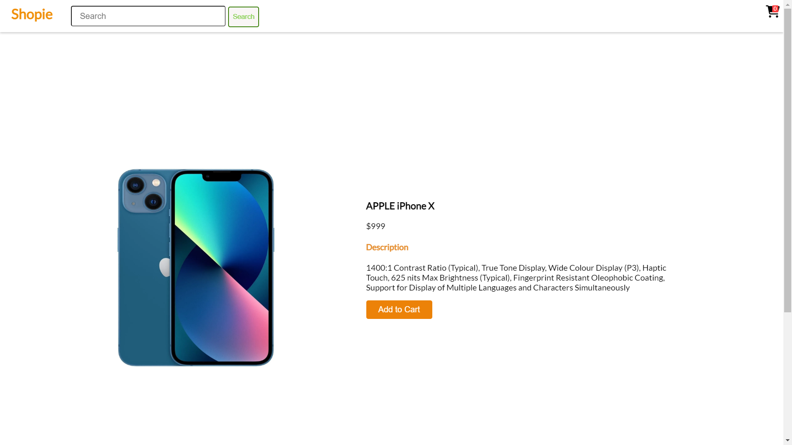
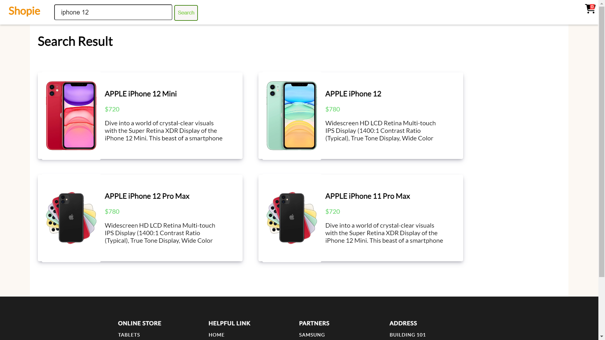
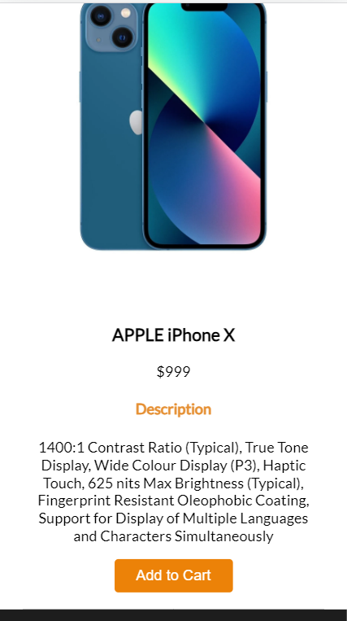

<h1 align = "center">e-commerce website ⬇️</h1> 

<h4 align = "center">`jQuery` 🔵 `HTML-CSS` 🔵 `JavaScript`</h4>
---

<h4 align = "center">⚡images ⚡</h4>

<h4 align = "center">📱Mobile View📱</h4> 

|   |   |
|---|---|